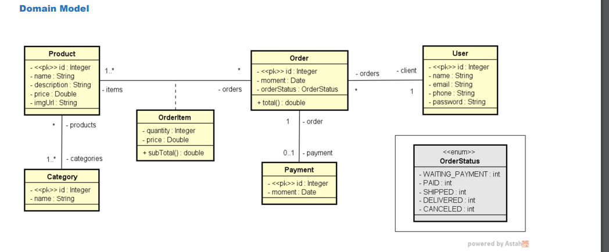
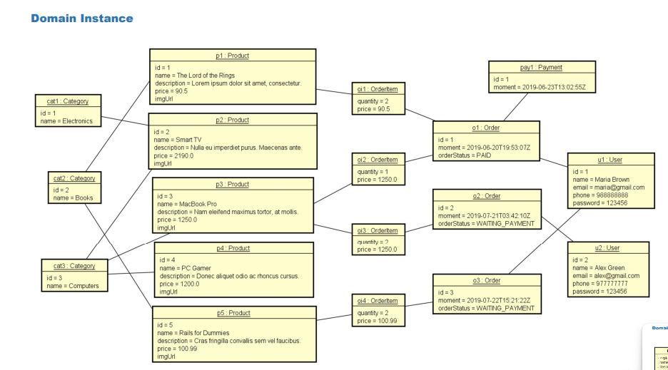
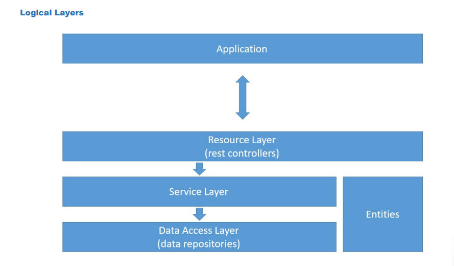

# Workshop Spring Boot 3 + JPA

Este projeto foi desenvolvido seguindo o curso "Java Completo" do professor Nelio Alves, disponível na plataforma Udemy. Ele tem como objetivo aplicar os conceitos de desenvolvimento backend com Spring Boot 3 e JPA, usando boas práticas de programação e arquitetura em camadas.

---

## Sobre o projeto

O projeto implementa um sistema simples de gerenciamento de pedidos com as seguintes funcionalidades principais:

- Cadastro e manipulação de **Usuários**, **Produtos** e **Categorias**.
- Registro de **Pedidos** com múltiplos itens, pagamento e status.
- Uso de **DTOs**, camadas de serviço e repositório para organização do código.
- Tratamento personalizado de exceções.

---

## Diagramas do Projeto

### Modelo de Domínio (UML)

Este diagrama mostra as entidades principais do sistema e suas relações:

### Instância do Domínio

Exemplo de instâncias dessas entidades com dados reais para ilustrar como os objetos interagem:

### Camadas Lógicas da Arquitetura

Diagrama explicando a arquitetura em camadas do projeto:

---

## Como rodar o projeto

1. Clone este repositório.
2. Importe no seu IDE favorito (ex: IntelliJ IDEA).
3. Configure o banco de dados no `application.properties`.
4. Rode a aplicação como um projeto Spring Boot.
5. Use os endpoints REST para interagir com o sistema.

---
